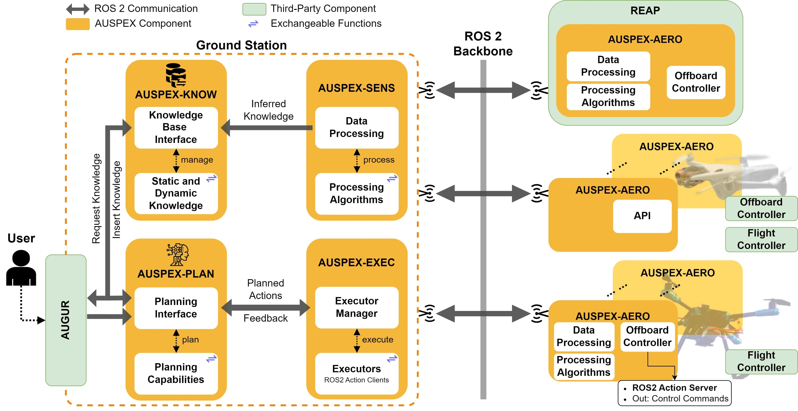

# AUSPEX
<div align="center">
  
</div>

---

### **A**utomated **U**nmanned Aerial Swarm **S**ystem for **P**lanning and **EX**ecution (**AUSPEX**)


In ancient Rome an auspex (latin for "one who observes the birds") was a priest who studied bird behavior (flight patterns, calls, or feeding habits) to determine the will of the gods.

To cite **AUSPEX**, please use the following reference:
```
@article{Doeschl-et-al:2025:AUSPEX,
  author = {Bj{\"o}rn D{\"o}schl and Kai Sommer and Jane Jean Kiam},
  title = {{AUSPEX: An Integrated Open-Source Decision-Making Framework for UAVs in Rescue Missions}},
  publisher = {TechRxiv.org},
  year = {2025},
  month = {March},
  doi = {10.36227/techrxiv.174123265.55724570/v1},
  url = {https://www.techrxiv.org/doi/full/10.36227/techrxiv.174123265.55724570/v1}
}
```
---
## Overview

AUSPEX is a modular framework for developing and validating AI planning algorithms for UAVs.
It can be used together with [REAP](https://github.com/UniBwM-IFS-AILab/REAP) as simulation environment.

### AUSPEX components
   * AUSPEX-AERO &rarr; Onboard Software, including the Offboard Controller
   * AUSPEX-EXEC &rarr; **EXEC**ution Module
   * AUSPEX-PLAN &rarr; **PLAN**nning Module
   * AUSPEX-SENS &rarr; **SENS**or Data Processing Module
   * AUSPEX-MSGS &rarr; **M**e **S**sa**G**e**S**
   * AUSPEX-KNOW &rarr; World **KNOW**ledge Base
   * AUSPEX-VASA &rarr; Docker Folder
   * utils &rarr; folder containing utils to setup the environment

### External components (Will be installed inside the Docker Container)
   * AirSim
   * PX4 Autopilot
   * Micro-XRCE-DDS-Agent

## System requirements

We tested AUSPEX using the following development environment:
   * Windows 11
   * WSL2 instance (Ubuntu 22.04 LTS)
   * Docker
   * Nvidia-Container-Toolkit for TERRA and specific AVIS versions

To enable visualization, ensure that Unreal Engine with the AirSim plugin is installed and running on the Windows 11 side. The confirmed working version of Unreal Engine for this setup is 4.27.2. If you're using Colosseum (an AirSim fork maintained by CodexLabsLLC), note that it supports Unreal Engine 5.2. To use Colosseum, follow the same installation steps as for AirSim, but substitute in the Colosseum repository from CodexLabsLLC.

The AUSPEX framework—which includes planning, execution, offboard control, and message definitions—runs within WSL (Windows Subsystem for Linux). Therefore, before proceeding, make sure to properly install WSL 2.

---

## Quick Start: AUSPEX with Simulation Environment

1. [Install Unreal Engine](#install-unreal-engine-with-the-airsim-plugin)
2. [Setup AUSPEX Terra](#setup-auspex-terra-groundstation-and-simulation-with-wsl2)
3. Launch the simulation Environment
4. Start the docker container:
   ```
   run_terra_vasa
   ```
5. In WSL Type:
   ```
   win_start_sim
   ```
   to start AUSPEX
6. Type:
   ```
   start_command_publisher
   ```
   in the docker container and enter `start` to launch a mock plan.

---

## Install Unreal Engine with the AirSim Plugin

Follow the instructions under: https://microsoft.github.io/AirSim/build_windows/. The most up-to-date Version of Unreal Engine confirmed to be working is currently 4.27.2.

Furthermore, AirSim requires a settings file to operate (should be located under "%USERPROFILE%/Documents/AirSim"). Exchange the default settings.json file with the settings file provided in this [repository](https://git.unibw.de/angewandte-ki-f-r-dynamische-systeme/AUSPEX/-/tree/main/utils/airsim_settings?ref_type=heads). For detailed information about AirSim settings see: https://microsoft.github.io/AirSim/settings/.

---

## Setup AUSPEX Terra (Groundstation and Simulation) with WSL2
We are using WSL2 to host our AUSPEX system, where ROS2 and external components are installed inside a docker container.
### 1. Setup WSL2 as Host System
Before cloning this repository prepare an Ubuntu 22.04 WSL instance.
The easiest way is to download a tarball, which contains an [Ubuntu 22.04 image](https://cloud-images.ubuntu.com/wsl/releases/22.04/current/).
To import the image to your WSL open a PowerShell terminal and run:
```
wsl --import Dev_Companion22 <path-to-install> <path-to-tarball>
```
It is important to set the distribution name to:
```
Dev_Companion22
```
The path-to-install can be chosen, e.g. C:\WSL\devcompanion
Before running the WSL instance add:
```
[wsl2]
networkingMode=mirrored
```
to the WSL config in Windows:
```
C:\Users\YourUsername\.wslconfig
```
This enables the mirroring of the Host Network. To ensure wsl is restarted type:
```
wsl --shutdown
```
Then run the new WSL instance by:
```
wsl -d Dev_Companion22
```
To add a new user (besides root):
```
sudo adduser companion
```
and add it to the sudo group
```
adduser companion sudo
```
switch to the new user by:
```
su companion
```
add this user as default user on startup and enable systemd (This will replace the wsl.conf file):
```
sudo sh -c "echo '[user]\ndefault=$(whoami)\n[boot]\nsystemd=true' > /etc/wsl.conf"
```
run one update and upgrade:
```
sudo apt update && sudo apt upgrade
```
Now you can set up your git configuration and begin the installation of AUSPEX.

### 1.2 Git Configurations
First create a Personal Access Token. This can be used for authentication without prompting for password and username on each GitHubAPI access. A manual can be found
[https://docs.github.com/en/authentication/keeping-your-account-and-data-secure/managing-your-personal-access-tokens](https://docs.github.com/en/authentication/keeping-your-account-and-data-secure/managing-your-personal-access-tokens).

And allow git to store your credentials:
```
git config --global credential.helper store
```

### 1.3 Open Ports for PX4 in WSL2

Incoming TCP port 4560 and incoming UDP port 14540 are required for connecting PX4 running in WSL to the unreal simulation. The ports can be opened using the firewall configuration (run WF.msc -> left click inbound rules -> action: new rule).

### 2. Install the AUSPEX Framework (Terra Version)
Inside your host system, for cloning this repository run:
```
git clone https://github.com/UniBwM-IFS-AILab/AUSPEX.git
```
For installation we provide an installation script, which will:
   * Get the submodules
   * Setup enviroment variables and aliases

It can be found in main folder.
```
cd ~/AUSPEX/
```
For running the script provide an argument, which specifies the installation variant.
It can be:
   * TERRA: full installation, including modules needed for simulation
   * AVIS: installs only modules needed for deploying on real hardware (e.g. on UAV)

Assuming you would like to install the full framework including the simulation modules run:
```
./install.sh TERRA
```
This will clone the submodules and set some default settings.
Copy the contents of `~/auspex_params/platform_properties/example_sim_platform_properties.json` to `~/auspex_params/platform_properties/platform_properties.json` or enter individual values, which specify your simulated platform:
```
cp ~/auspex_params/platform_properties/example_sim_platform_properties.json ~/auspex_params/platform_properties/platform_properties.json
```
and type:
```
ds ~/AUSPEX/ && python3 setup.py
```
to read in the variables form the platform properties file.
Restart you WSL 2 instance or you host PC system.
To build the docker container type:
```
build_terra_vasa
```
This may take some time. After it is finished, the installation is done and ready to use.

---

## Install AUSPEX AVIS (UAV Part) on Ubuntu:
Follow the instructions from [Install AUSPEX TERRA](#2-install-the-auspex-framework-terra-version). To setup AUSPEX on a real UAV, use the **AVIS** keyword during installation instead of **TERRA** as described there.

Overwrite the default ```platform_properties.json``` for each UAV to suite its respective capabilities. (Camera FOV, ...)
```
nano ~/auspex_params/platform_properties/platform_properties.json
```
Now the general setup is done and you are ready to use a real UAV with AUSPEX

---

## Network Setup (Only needed for controlling real Hardware)

When working with real UAVs, the UAVs and the AUSPEX system should be in the same local network (e.g. via Router, VPN or ROS 2 Bridges). Moreover, to use ROS 2 over a VPN a Discovery Server is necessary. Set up a discovery server and export its IP on the UAV, as well as every system which is part of AUSPEX:
```
export ROS_DISCOVERY_SERVER=<DISCOVERY_IP>:11811
```
For convenience, add the export commands to the ```~./bashrc```.
Auspex can be deployed on distributed hardware, as long as each system is connected to the Discovery Server.

**Optional:** If the discovery server is not working, it is possible to set up the ROS 2 communication as peer to peer, multicast network. For this export the FASTRTPS_DEFAULT_PROFILES_FILE:

```
export FASTRTPS_DEFAULT_PROFILES_FILE=~/<SETUP_FILE>.xml
```

and add a ```<locator><udpv4><address>"PEER_IP"</address></udpv4></locator>``` tag, for each peer in the system and exchange the ```PEER_IP``` with the IP address of the respective peer.
**NOTE:** This will drastically increase the communication overhead, in comparison to [discovery servers](https://docs.ros.org/en/foxy/Tutorials/Advanced/Discovery-Server/Discovery-Server.html).