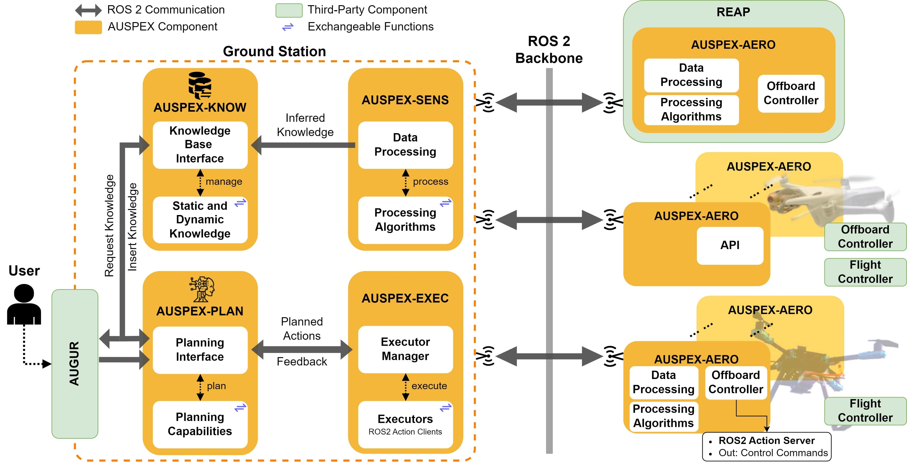

# AUSPEX
**A**utomated **U**nmanned Aerial Swarm **S**ystem for **P**lanning and **EX**ecution (**AUSPEX**)

In ancient Rome, an *auspex* (Latin for "one who observes the birds") was a priest who studied bird behavior (flight patterns, calls, or feeding habits) to determine the will of the gods.

To cite **AUSPEX**, please use the following reference:
```
@article{10.3389/frobt.2025.1583479,
   AUTHOR={D{\"o}schl, Bj{\"o}rn  and Sommer, Kai  and Kiam, Jane Jean },
   TITLE={AUSPEX: An integrated open-source decision-making framework for UAVs in rescue missions},
   JOURNAL={Frontiers in Robotics and AI},
   VOLUME={Volume 12 - 2025},
   YEAR={2025},
   URL={https://www.frontiersin.org/journals/robotics-and-ai/articles/10.3389/frobt.2025.1583479},
   DOI={10.3389/frobt.2025.1583479},
   ISSN={2296-9144}
}
```

## 1. Overview
AUSPEX is a modular framework for developing and validating AI planning algorithms for UAVs.
It can be used in combination with [REAP](https://github.com/UniBwM-IFS-AILab/REAP) as a simulation environment and with [AUGUR](https://github.com/UniBwM-IFS-AILab/AUGUR) as a GUI.

<div align="center">
  
</div>

### 1.1 AUSPEX Components
   * AUSPEX-AERO &rarr; Onboard Software, including the Offboard Controller (Onboard)
   * AUSPEX-EXEC &rarr; **EXEC**ution Module (Onboard)
   * AUSPEX-MSGS &rarr; **M**e **S**sa**G**e**S**
   * AUSPEX-PLAN &rarr; **PLAN**nning Module
   * AUSPEX-SENS &rarr; **SENS**or Data Processing Module
   * AUSPEX-KNOW &rarr; World **KNOW**ledge Base
   * AUSPEX-VASA &rarr; contains Docker container configuration files
   * utils &rarr; folder containing utils to setup the environment
   * params &rarr; folder with parameters and know configs
   * docs &rarr; detailed installion guides

### 1.2 External Components (parts of the Docker image)
   * Colosseum (AirSim)
   * PX4 Autopilot

Date: May 2026

## 2. Installation

### 2.1 System Requirements
We tested AUSPEX using the following development environments:
   * Windows 11 with a WSL2 instance (Ubuntu 22.04 LTS / Ubuntu 24.04 LTS)
   * Native Linux on Ubuntu 24.04 LTS and 22.04 LTS
   * Different offboard controllers (NVIDIA Jetson Orin NX, NVIDIA Jetson Xavier NX, Raspberry Pi 5)

### 2.2 Installation Helper
Choose the setup that matches your use case:

| Use case | Groundstation / host | UAV | Notes |
| --- | --- | --- | --- |
| AUSPEX with real UAVs | Install `AUSPEX` | Install `AUSPEX` | `AUSPEX` uses `OBC-Type` to determine whether it is running on a groundstation or UAV |
| Simulation (Groundstation + Simulated UAVs) | Install `AUSPEX` and the simulation environment. | Not required | `AUSPEX` includes the groundstation and simulation setup |
| Groundstation only | Install `AUSPEX` | Not required | Does not include simulation setup instructions. |

<details>
<summary><strong>Use Case: AUSPEX with real UAVs</strong></summary>

* Install `AUSPEX` on the groundstation:
   Skip 2.3.1
   1. See 2.3.2, or follow the [Desktop hardware preparation](docs/host_setup/desktop_ubuntu.md).
   2. See 2.3.3 or follow the [AUSPEX installation guide](docs/auspex_setup.md).
* Install `AUSPEX` on each UAV. For each UAV:
   1. See 2.3.1 and set up your UAV hardware [hardware setup](#231-uav-hardware-setup)
   2. See 2.3.2 and follow the [host setup](#232-preparing-host-hardware-for-auspex) for the respective offboard controller.
   3. See 2.3.3 or follow the [AUSPEX installation guide](docs/auspex_setup.md).

</details>

<details>
<summary><strong>Use Case: Simulation</strong></summary>

* Install a compatible simulation environment. AUSPEX has been tested with Unreal Engine 4.27/5.2 and AirSim, or with NVIDIA Isaac Sim and Pegasus Simulator: [Isaac Sim](docs/simulation_setup/isaacsim.md) or [Unreal Engine](docs/simulation_setup/unreal_engine.md)
* Install `AUSPEX` on the groundstation:
   1. See 2.3.2, or follow the [Desktop hardware preparation](docs/host_setup/desktop_ubuntu.md).
   2. See 2.3.3 or follow the [AUSPEX installation guide](docs/auspex_setup.md).
This is the recommended setup if you want to run AUSPEX in simulation and later test it on real hardware, since this also installs AUSPEX as the groundstation.
</details>

<details>
<summary><strong>Use Case: Groundstation only</strong></summary>

* Install `AUSPEX` on the groundstation:
   1. See 2.3.2, or follow the [Desktop hardware preparation](docs/host_setup/desktop_ubuntu.md).
   2. See 2.3.3 or follow the [AUSPEX installation guide](docs/auspex_setup.md).
   Use this setup if you only need the groundstation side.
</details>

### 2.3 Detailed Installation
These are the detailed installation instructions, which are summed up in 2.2 Installation Helper. AUSPEX has to be installed on each hardware using it: Desktop/Groundstation, UAVs, etc.. The installtion is structured in three steps (Two without UAVs). 

1. (For UAVs only) Build/setup the hardware UAV. 
2. Install all dependencies and prepare the host computer for AUSPEX.
3. Install AUSPEX. 

These steps are described in detail in the following.

### 2.3.1 UAV Hardware Setup
For a quick setup, we provide build instructions for frequently used UAVs.
* For [Holybro x500v2/x650](docs/uav_setup/holybro_x500v2_x650.md).

* For [Racing Kit with NVIDIA Jetson Orin NX](docs/uav_setup/racing_kit.md).

* For [Multikopter MK-u20](docs/uav_setup/mk-u20.md).

#### 2.3.2 Preparing Host Hardware for AUSPEX
Some initial configuration and setup steps must be completed before AUSPEX can be installed. These depend on the host machine (desktop for simulation and groundstations, and offboard controller for UAVs).
* For [Desktop PCs running Ubuntu](docs/host_setup/desktop_ubuntu.md).

* For WSL Setup: [Desktop PCs running Windows](docs/host_setup/desktop_windows.md).

* For [Raspberry Pi 5](docs/host_setup/raspberry_pi5.md).

* For [NVIDIA Jetson Orin NX](docs/host_setup/nvidia_jetson_orin_nx.md).

* For [NVIDIA Jetson Xavier NX](docs/host_setup/nvidia_jetson_xavier_nx.md).

### 2.3.3 AUSPEX Installation
* After preparing the hardware, the AUSPEX installation is the same for all hardware platforms and is described [here](docs/auspex_setup.md).


### 2.4 Setup AUGUR, the GUI to AUSPEX
The simple GUI für AUSPEX was created using Flutter. The installation manual and downloads can be found here: https://docs.flutter.dev/install/manual. 
For AUGUR:
```
https://github.com/UniBwM-IFS-AILab/AUGUR
```
Clone AUGUR on your local machine and type `flutter run` in the root repository folder to run AUGUR.


## 3. Quick Start AUSPEX with Simulation Environment
Make sure you followed the full installation guide below beforehand.

1. Launch the visualization environment

   * [Windows] Launch Unreal Engine 5.2.1 and select Map-Environment/Project

2. [Windows] Start WSL in a Terminal / Windows Power Shell by typing `wsl`

3. Start the docker container (in the WSL by selecting a new tab of `companion@LaptopName` and type): `vasa_shell`

4. To use the GUI AUGUR, start inside the docker container the data connection typing `bridge_run`.

5. Start AUSPEX (simulation) by typing `auspex_run_sim_ue` in the WSL (Windows/Linux)

6. Start AUGUR by opening a command line in its folder and type `flutter run` to build and start it. Create a trajectory in AUGUR and execute it. The UAV should be flying in the simulation environment.


