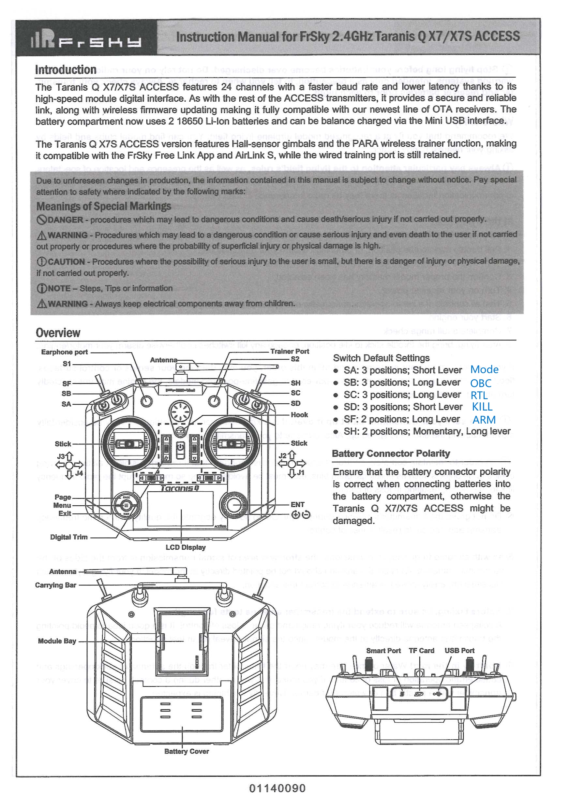
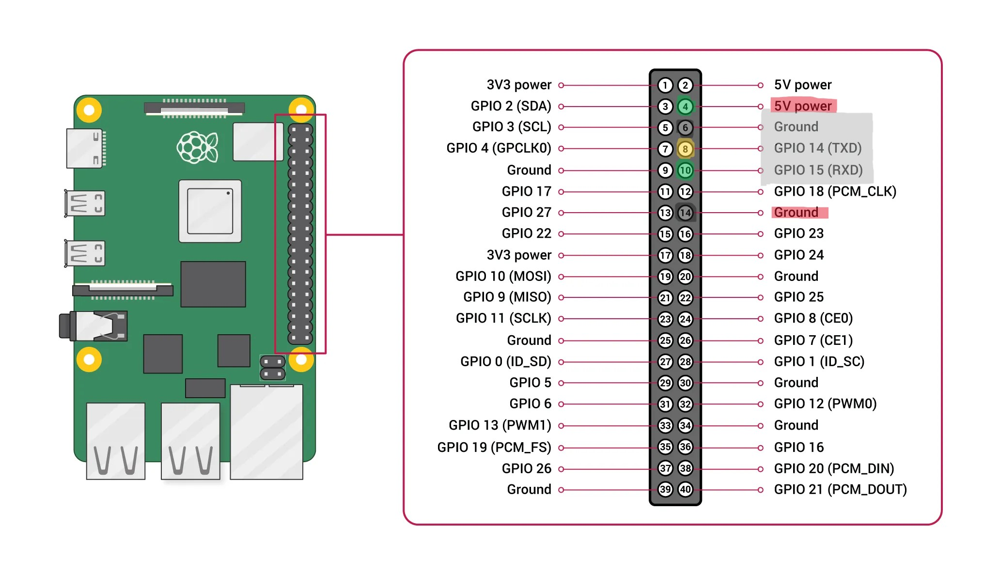

# Setup Holybro X500 v2 (PX4)
This should be the drone to be build: https://holybro.com/collections/multicopter-kit/products/px4-development-kit-x500-v2

Date: Nov 2025


## 1. Hardware Setup
The things you need to set up your Holybro drone are:
- Holybro drone (Holybro X500 v2 PX4 Dev Kit) (shipped in a small box)
- Remote Control (Transmitter): FrSky Taranis Radio System X7ACCESS
- Remote Control Receiver: FrSky X8R-PCB
- Batteries for the Remote Control Transmitter
- Battery for the Holybro Drone


### 1.1 Build
The provided manual for the setup is rather short, so it is highly recommended to watch the YouTube video beforehand, to get an impression what you need to do overall https://www.youtube.com/watch?v=27rbxCeCq4Y&t=1s.
Also take a look at this github repository: https://github.com/PX4/PX4-Autopilot/blob/main/docs/en/frames_multicopter/holybro_x500v2_pixhawk6c.md.
(Even though you might wonder why you should watch it beforehand, it might be handy doing so to avoid mistakes. Even better to have a build one ready to have a look at it.)
The paper manual is mainly important to see which screws you need in which step. 

For our setup, we use another remote control:
- Do not mount the telemetry radio transmitter provided by Holybro, we don't need that one, but ...
- ... mount the FrSky Remote Control Receiver instead. Here is a video on how to do it: https://www.youtube.com/watch?v=RH_RuVbF2YU. We use SBUS.
It is advisable to mount it to the bottom side of the top plate (like the PWM thing) to have a clean setup. Mount it to he left or the right side, at a very out position, as you need to have access to a button on its top (antenna side) later on. The antennas need to go outside and can be fixed to cable ties, which are fixed at the smaller holes of the bottom plate. Connect a cable to PPM/SBUS RC. 
- Further, if you also want to add an Raspberry Pi and a servo motor to your Holybro, you need two more possibilities to get 5V power. Thus, add two BECs (Battery Eliminator Circuits) which also need to go underneath the top plate. Add them beforehand and try to get access to the 5V connectors from the outside to plug-in the cables later.

### 1.2 Calibrate Part 1- Airframe and Sensors
- Download https://qgroundcontrol.com/ and install it
- Watch the same YouTube Video as before: https://youtu.be/27rbxCeCq4Y?si=vsonz-mghwZrX9WH (as of 19:36).
- First, do a Firmware Update (current version: PX4 Pro v1.16.0 - Stable Release)
- Follow the first and second steps in QGroundControl as given in the video you just watched (Airframe, Sensor --> Accelerometer)

### 1.3 Connect Remote
- put batteries in the remote and watch the video https://www.youtube.com/watch?v=RH_RuVbF2YU again, paying attention how to connect the Receiver and transmitter.
- Connect both by selecting `Ch1-8 T. ON` (You should hear an annoying sound)

### 1.4 Calibrate Part 2 - Radio


- Calibrate the radio using the guided steps. At some point, you must have moved all sticks and switches to be able to assign them later.
- take the manual out of the box to get a better overview of the switches names
- Somehow, only the both sticks and their functions are occupied. You need to add all switches manually as written below.
- Go to the main menu (three horizontal bars) and follow to the `INPUTS` (page 5/12) by clicking on the PAGE button:
    - Select a free input, press ENTER (center of the wheel)
    - go to `Source` and press ENTER
    - move the input you would like to use (a shortcut will be displayed for the switch, like `xy`) and press EXIT
    - move to `Input` and assign the same shortcut there as displayed in `Source`
    - confirm this with exit and move back with exit as well
    - repeat this for all inputs. Now, you have added the inputs of the remote internally. We need to do that externally as well to be able to use it with the Holybro drone.
- move one page forward to `MIXES` (page 6/12):
    - Add the functions to the channels by going to a free Channel `CHX`
    - press ENTER to go the specific channel `CHX`
    - one line below at `Mix name`, you can assign the function name of the switch to it, confirm with EXIT (if a switch has no function, leave its name free)
    - select at `Source` the matching source. 
- moving now the sticks, knobs and switches, you can see that the sliders in QGroundControl moving.
It would be now the correct time to put stickers on the remote about what the switches are doing.
- In the next step, move to `Flight Modes` in QGroundControl to add assign the flight modes to the specific switches. See the table below for the allocation.

| Setting | Channel |
| ----------- | ----------- |
| Mode Channel | Ch7 |
| Flight Mode 1 | Takeoff |
| Flight Mode 4 | Position |
| Flight Mode 6| Land |
| Flight Mode 2,3,5 | Unassigned |
| Arm switch channel | Ch5 |
| Emergency Kill switch channel | Ch10 | 
| Offboard switch channel | Ch8 |
| Landing gear switch channel | Unassigned |
| Loiter switch channel | Unassigned |
| Return switch channel | Ch9 | 

For the values of the switches go from -100 to +100. The -100 is located away from the person, the +100 is located towards the person.


### 1.5 Calibrate Part 3 - Power, Actuators and Safety
- In the `Power Config` set the `Number of Cells (in Series)` to 4 and perform the `ESC OWM Minimum and Maximum Calibration`.

- In `Actuators Config` check the position of the motors and in `PWM MAIN` assign the MAIN 1 - 4 to the Motors 1 - 4. Now test the actuators carefully.

- Last, go to `Safety` and check the the Failsafe Flags in QGC:
    ```
    Set Low Battery Failsafe Trigger --> Failsafe Action to Land mode
    Set RC Loss Failsafe Trigger to Return mode
    Geofence Failsafe Trigger --> Return mode / 500m / 120m
    ```


### 1.6 Setup for the PixHawk 6c
In QGrouundControl go to `Parameters` and change the following settings. This is necessary to enable the connection of an external micro controller to the Flight Controller.

For mavsdk via QGroundControl:
```
Set MAV_0_CONFIG to Telem2
Set MAV_0_MODE to OnBoard
Set MAV_0_RATE to 0
```


## 2. Setup for the Raspberry PI 5 and a Camera

### 2.1 Building
You need: 
- A Raspberry Pi (Generation 5)
- A case for the Raspberry Pi
- A BEC to power the Raspberry Pi

Preparation:
- Add a BEC to supply power to the Raspberry Pi.

Mount the Raspberry Pi inside its case, add the heat sink and the silicon feet to the case and mount it below the GPS antenna. Screws can be taken from the initial Holybro setup and seem to be short but work well. The USB-C port from the Raspberry Pi should be easily accessible from the backside, while the pins are closer to the drones center.


### 2.2 Cabling
You need to connect the Raspberry Pi at its pins to the BEC and the Flightcontroller. You need two (very same looking) cables, so it might be helpful to highlight them with different colors of tape. 
For the cable from the BEC, you only need the two outer cables. We choose the color to be red (as shown by the highlighted pin name).
For the cable to/from the flight controller (port `TELEM2`), we chose the color grey and fixed the plugs for the pins in the same sequence as they are in the cable.
Connect the cables as shown in the following picture:



### 2.3 Adding a Camera
You need a Raspberry Pi Camera, a lens and a connector cable.
(Optionally, you can add a second camera with a different lens or a different camera at all, as there are two camera inputs on the board available.)
Moreover, you need a second Holybro Payload kit allowing to mount the camera at the UAV (at the opposite side of the Raspberry Pi).
Hint: Make sure your camera cable fits the Raspberry Pi slots.